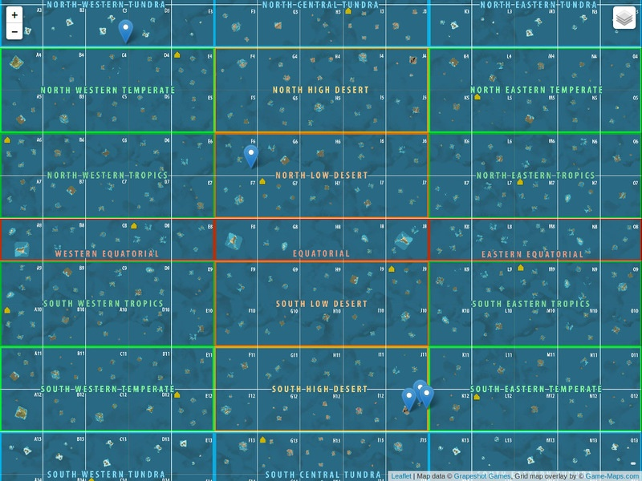

# atlas-mmo-resources-map
This is [leaflet](https://leafletjs.com/) based Atlas (mmo game) map that uses [google sheets](https://docs.google.com/spreadsheets/d/1__t--zxgGBV4arofMVay2e9F0K1TzkbkuDLKeZw2iLY/edit?usp=sharing) to present markers.

# google sheet structure

 
# screenshot

# license
All code files written by me (application.js, index.html and download_official_maps.rb) are licensed under MIT License. 

Rest of assets (images) are unknown license. 

tiles are downloaded from [Grapeshot Games](https://map.playatlas.com/)

grid_map.png is from [Game-Maps.com](https://game-maps.com/ATLAS/ATLAS-MMO-World-Map.asp)
 